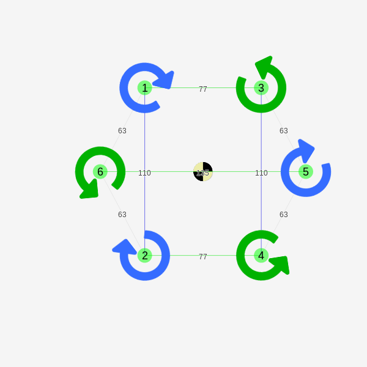

## HexOne

A custom-built hex micro copter.

### Layout



Input for mixer calc:

```
1 3 h
2 4 h
1 2 v
3 4 v
6 5 h
1 3 77
2 4 77
6 5 135
1 2 110
3 4 110
1 6 63
6 2 63
3 5 63
5 4 63
```

Resulting mix table (on "cleanflight from 1.10 onwards" setting):

```
mmix 0 1 0.567 -0.815 -1
mmix 1 1 0.567 0.815 -1
mmix 2 1 -0.567 -0.815 1
mmix 3 1 -0.567 0.815 1
mmix 4 1 -1 0 -1
mmix 5 1 1 0 1
```

### Components

Onboard:

* [Frame](https://www.banggood.com/LANTIAN-Spider-150-HEX-6-Carbon-Fiber-DIY-Micro-FPV-RC-Quadcopter-Frame-Support-8520-Coreless-Motor-p-1079962.html)
* [Controller](https://www.banggood.com/Eachine-32bits-F3-Brushed-Flight-Control-Board-Based-On-SP-RACING-F3-EVO-For-Micro-FPV-Frame-p-1076530.html)
* [Propellers](https://www.banggood.com/Upgraded-Hubsan-H107-X4-RC-Quadcopter-Spare-Parts-Blade-Set-p-81701.html)
* [Motors](https://www.banggood.com/2Pcs-8520-8_5x20MM-28000RPM-2_1V-DC-Brushed-Coreless-Motor-CWCCW-71mm87mm-for-DJI-Ryze-TELLO-Drone-p-1284632.html)
* [USB2RS323](https://www.banggood.com/CJMCU-CP2102-USB-To-TTLSerial-Module-UART-STC-Downloader-p-970993.html)

To be added:

* [Pressure sensor](https://eu.banggood.com/Wholesale-Warehouse-GY-BMP280-3_3-High-Precision-Atmospheric-Pressure-Sensor-Module-For-Arduino-wp-Eu-1111135.html)
* [TFL distance sensor](https://ru.aliexpress.com/item/GY-530-VL53L0X-laser-range-finder-ToF-distance-measurement-Flight-time-range-sensor-module/32840503781.html)

## References

* https://www.iforce2d.net/mixercalc/